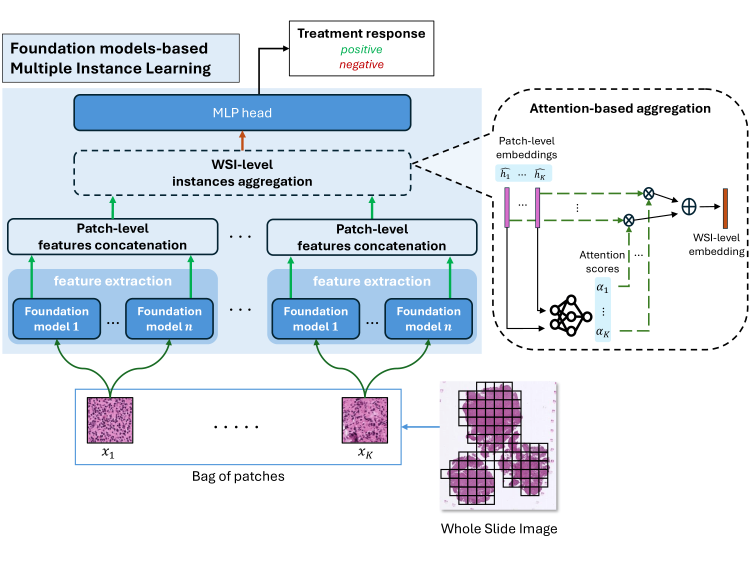

# Histopathology image embedding based on foundation models features aggregation for patient treatment response prediction [MICCAI MOVI workshop 2024]

<details>
<summary>
    <b>Histopathology image embedding based on foundation models features aggregation for patient treatment response prediction</b>. <a href="https://doi.org/10.48550/arXiv.2408.03954" target="blank">[arxiv]</a>
</summary>

```tex
@article{Guetarni2024HistopathologyIE,
  title={Histopathology image embedding based on foundation models features aggregation for patient treatment response prediction},
  author={Bilel Guetarni and F{\'e}ryal Windal and Halim Benhabiles and Mahfoud Chaibi and Romain Dubois and Emmanuelle Leteurtre and Dominique Collard},
  journal={ArXiv},
  year={2024},
  volume={abs/2408.03954},
}
```

**Abstract:** Predicting the response of a patient to a cancer treatment is of high interest. Nonetheless, this task is still challenging from a medical point of view due to the complexity of the interaction between the patient organism and the considered treatment. Recent works on foundation models pre-trained with self-supervised learning on large-scale unlabeled histopathology datasets have opened a new direction towards the development of new methods for cancer diagnosis related tasks. In this article, we propose a novel methodology for predicting Diffuse Large B-Cell Lymphoma patients treatment response from Whole Slide Images. Our method exploits several foundation models as feature extractors to obtain a local representation of the image corresponding to a small region of the tissue, then, a global representation of the image is obtained by aggregating these local representations using attention-based Multiple Instance Learning. Our experimental study conducted on a dataset of 152 patients, shows the promising results of our methodology, notably by highlighting the advantage of using foundation models compared to conventional ImageNet pre-training. Moreover, the obtained results clearly demonstrates the potential of foundation models for characterizing histopathology images and generating more suited semantic representation for this task.

</details>



## Installation

Please make sure the following packages are installed.

    - conch
    - huggingface-hub
    - numpy
    - nystrom-attention
    - openslide-python
    - pandas
    - pillow
    - scikit-learn
    - scikit-image
    - timm (1.0.3)
    - torch (1.8.1)
    - torchvision (0.9.1)
    - tqdm

The article expermients were done under Python 3.9 and PyTorch v1.8.1 with CUDA 10.1 on 4 Tesla V100 32Gb.

## Data Preprocess

To create the dataset for model training, patches must be extracted and then features from the foundation models and finally split into folds.
First run `dataset.py` to extract patches from WSI files saved in a folder.
Next, the `features.py` will extract features from the saved patches with the chosen feature extractor (see `--model` argument) and save them on disk.

Note that for [CONCH](https://github.com/mahmoodlab/CONCH) and [Prov-GigaPath](https://github.com/prov-gigapath/prov-gigapath) you will need HuggingFace access to their model.
You will also need to provide a HuggingFace authorization token (see `--hf_token` argument) in order to use [CONCH](https://github.com/mahmoodlab/CONCH).

### Train and test

Run `main.py`to train and test a model while specifying which foundation model (or other) to use.
Foundation models available here are:
- [CONCH](https://github.com/mahmoodlab/CONCH)
- [Prov-GigaPath](https://github.com/prov-gigapath/prov-gigapath)
- [HIPT](https://github.com/mahmoodlab/HIPT)

You can also select an ImageNet pre-trained ResNet-50 for comparison.

## Reference

If you found our work useful in your research, please consider citing our works at:

```tex
@article{Guetarni2024HistopathologyIE,
  title={Histopathology image embedding based on foundation models features aggregation for patient treatment response prediction},
  author={Bilel Guetarni and F{\'e}ryal Windal and Halim Benhabiles and Mahfoud Chaibi and Romain Dubois and Emmanuelle Leteurtre and Dominique Collard},
  journal={ArXiv},
  year={2024},
  volume={abs/2408.03954},
}
```

The MICCAI published reference will be displayed upon publication.
